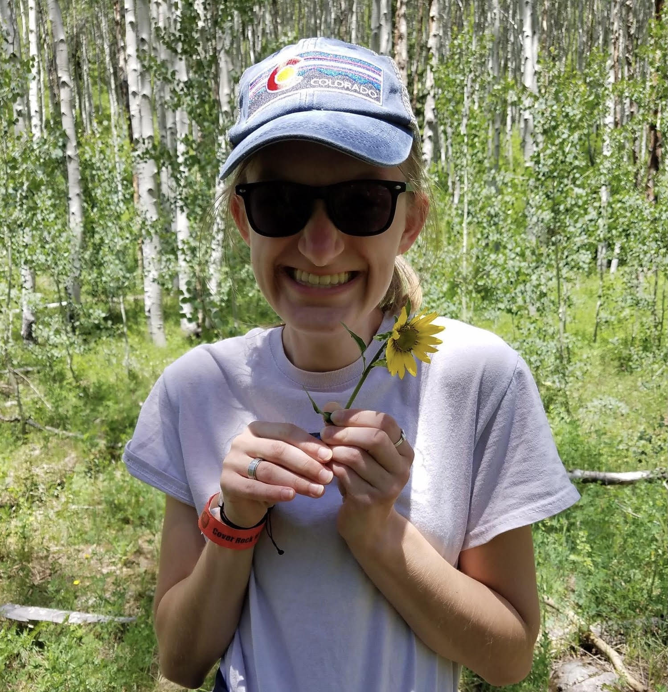

# Wicked Problems: DATA 100
### Morgan Carr
 
Hello! My name is Morgan, and I'm from Richmond, VA. I'm hoping to study Data Science and Public Health. I am also interested in the health field, and I actually took this class to maybe gain a deeper understanding of how this field has been able to revolutionize healthcare. Outside of class, I love learning about film and listening to music. Thank's for visiting my GitHub page! 
~Morgan

## Project Index
1. [R Studio Practice 8/24/2020](runningboy.md)
2. [Data Management Basics 8/28/2020](liberia.md)
3. [Lab 1, Pt. 1 9/2/2020](lab1pt1.md)
4. [Data Reflection 1 9/11/2020](reflection1.md)
5. [Lab 1, Pt. 2 9/14/2020](lab1pt2.md)
6. [Lab 2, Pt. 1 9/21/2020](lab2pt1.md)
