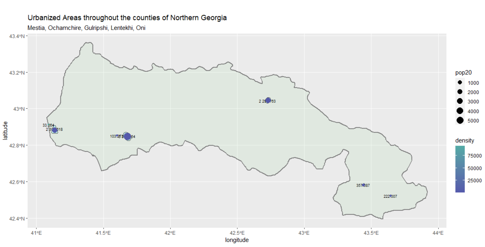
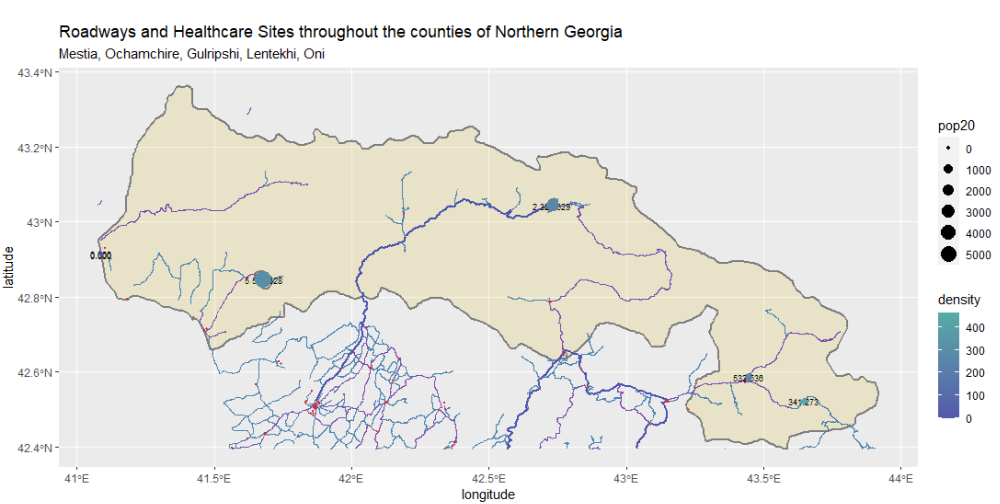
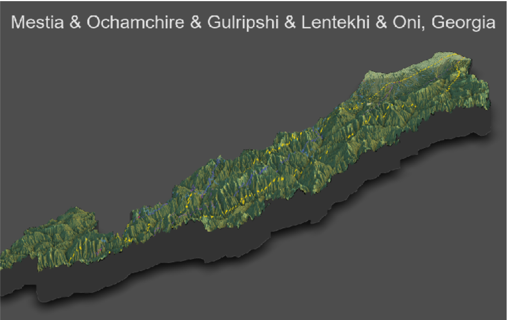

# Final Project
### Accessability 1: De facto description of human settlements and urban areas

[larger image of plot](urbanarrea.png)

> The subdivisions used in this analysis of Georgia were Mestia, Ochamchire, Gulripshi, Lentekhi, and Oni. These subdivisions are located in the Northern section of Georgia, and have a fairly low population relative to the rest of the country. This wasn't as interesting of a section of country to analyze as others, but it was somewhat fascinating to see how spread out civilazation is and how small the cities are. 
> I ran into quite a few problems in this project, some of which I don't think I ever really solved. First, every subdivision I tried prior to these ADMs wouldn't work with the bandwidth function. This set me back quite a bit for this assignment, but once it was fixed, Accessability 1 was fairly smooth sailing. Accessability 2 was relatively stress free to complete, but it did take a bit of fiddling to make sure that the roads and health care sites were visible. Finally, accessability 3 caused a few issues. I'm still not entirely sure why my plot turned out the way it did, but it does contain all the information required, minus the label of the largest urban area. My rstudio really did not like that line of code, and so I left it out so that I could complete the analysis of the data.

### Accessability 2: transportation facilities & health care services

[larger image of plot](healthytogether.png)

##### Total population of selected and combined adm2, adm3 or adm4 areas and the total number of distinctly defined human settlements or urban areas
> The total population for the subdivisions of this part of Georgia is 107,840. In this large area of land, there are 6 distinct settlements spread out over the 5 subdivisions that were used for this project. 
##### A description of the distribution of sizes and densities of all human settlements and urban areas throughout your selected and combined adm2, adm3 or adm4 areas
> The plot fo accessability 1 demonstrates this information more clearly, but the distribution of settlements are quite interesting in this area. There aren't really any sprawling networks of civilazation like that of the Liberia example. Intead, they appear to have densely populated city centers that have a very small area of population surrounding it. The two city center points that are on the westernmost part of the subdivision is located in Gulripshi. The next two points that are directly east are located in Ochamchire. The northernmost city point is located in Mestia, and the final few are in Oni. It's interesting how Lentekhi has no major urban developments, while all the others have one or two medium sized settlements. According to google maps, however, there is a small village located within Lentekhi that appears to have an incredibly small population, which is most likely why it did not show up on this analysis. 
##### A description of the roadways and your estimate of the transportation networks level of service in comparison to the spatial distriubtion of human settlements and urban areas
> Just outside of the subdivisions, there is a large mass of roadways that do somewhat spread into the subdivision. The dark blue/violet color indicates primary roadways. There is only really one primary roadway that is located within the subdivision. The purple color is secondary roadways, and there are about 3 that are within the subdivision lines. Finally, the light blue are tertiary, and there's over a dozen of them. The largest city point, in the northernmost part of the area has the only primary road going to it. All of the other cities include secondary and tertiary roadways. It appears that the roads outside of the subdivision are a very clear network of what could be settlements, similar to the roads within the subdivisions.  
##### A description of health care facilities and your estimate of service accessibility in comparison to the spatial distriubtion of human settlements and urban areas
> There really aren't a lot of healthcare facilities within the subdivision, which is quite alarming. It doesn't seem as though there are any clinics or hospitals close to the city centers, although the points themselves could be blocking the view of the facilities. It's interesting that they are so far away from the defined urban areas, as it seems like it would take a considerable amount of time to get to healthcare in the event of an illness or accident. All of the facilities are located right on the roadways, so there is a direct path from the cities to healthcare, but it's very spaced out. This could very well be because the area is so rural, so it's more financially smart to have these facilities spread out so that more people can have access to them.

### Accessability 3: Rendering Topography

[larger image of plot](mytopo.png)

##### How has topography appeared to have impacted the development of urban areas?
> The urban areas demonstrated on the topographical map are mostly located in the valleys of the mountain range that runs through the area. Since Georgia is an old country, and many of the settlements are from many years ago, building settlements in the mountains could have been for protection. Having the mountains surrounding a settlement could make it more difficult for enemies to try to attack since it would be so difficult to get there. Also, there are many environmental benefits from living in the valley, since there are generally river systems there, and the ground is more fertile for crop yields. 
##### How has topography appeared to have impacted the development of transportation facilities?
> The primary road system appears to try to go around the base of the mountains, whereas the secondary roads will go up and around if needbe. The tertiary roads seem to be almost exclusively for going up and down the mounain ridges in some cases. Having roads in the mountains is important for getting products in and out of towns, but it is difficult and expensive. This is why the smaller roads are okay to go through the higher points of the mountains and the primary roads are not.
##### How has topography appeared to have impacted the location of health care facilities?
> Nearly all of the healthcare facilities that are on this map are located either within settlements or in the valley or base of a mountain. The majority of these facilities are on the westernmost part of the map, nd that makes sense since there are less mountains, which means there are most likely many more small villages. While there aren't many facilities, seeing their location relative to the topography makes more sense, since having them at the tops of mountains makes way less sense then having them in the valleys and the bases. 
##### Has producing your three-dimensional map resulted in an interpretion that is different from your previous analysis?
> Not entirely, I knew this area was in the mountains, so there would be less room for there to be large cities and intensive roadways. It was interesting to have a physical location for the urban areas, since it explains why the areas are so densely populated without sprawling towns. Seeing the roadways as well explanis why they are more dense outside of this subdivision, since there are less mountains and more population areas there.
