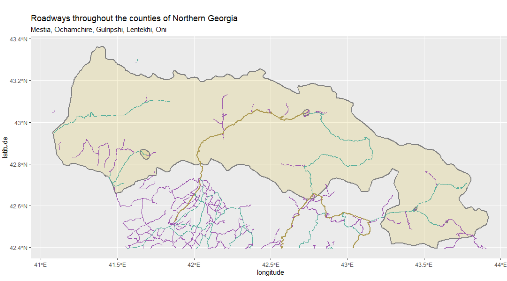

# Final Project
### Accessability 1: De facto description of human settlements and urban areas

[larger image of plot](urbanarrea.png)

Describe the area and identify large clusters of population and explain why the populatoin is so low and spread out
> 107840

### Accessability 2: transportation facilities & health care services
##### Roads

[larger image of plot](roads_geo.png)

##### Health Care Facilities

[larger image of plot](healthytogether.png)

###### Total population of selected and combined adm2, adm3 or adm4 areas and the total number of distinctly defined human settlements or urban areas
###### A description of the distribution of sizes and densities of all human settlements and urban areas throughout your selected and combined adm2, adm3 or adm4 areas
###### A description of the roadways and your estimate of the transportation networks level of service in comparison to the spatial distriubtion of human settlements and urban areas
###### A description of health care facilities and your estimate of service accessibility in comparison to the spatial distriubtion of human settlements and urban areas

### Accessability 3: Rendering Topography

###### How has topography appeared to have impacted the development of urban areas?
###### How has topography appeared to have impacted the development of transportation facilities?
###### How has topography appeared to have impacted the location of health care facilities?
###### Has producing your three-dimensional map resulted in an interpretion that is different from your previous analysis?
