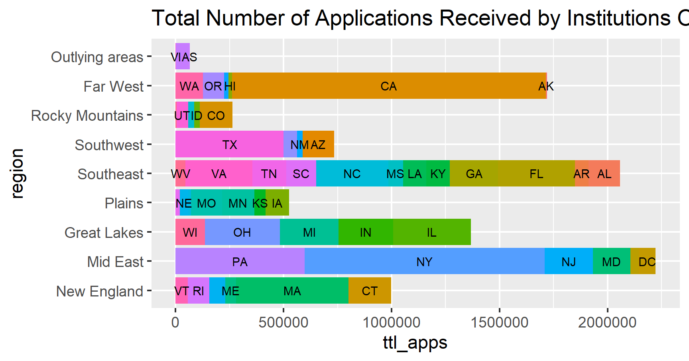
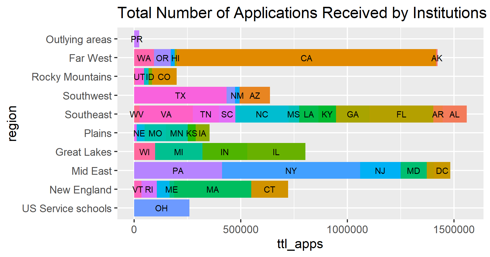

# Lab 1 Part 1

## Deliverable 1

> This graph gives the information on how many four year colleges there are per region. The differing colors and bars correspond to the states within each region. 

## Deliverable 2

> This graph gives the information on how many doctorate level programs there are per region. The differing colors and bars correspond to the states within each region. 
