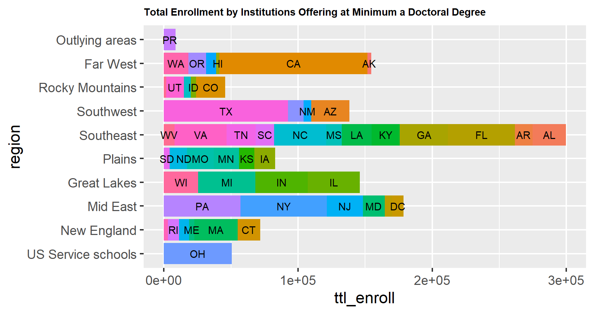
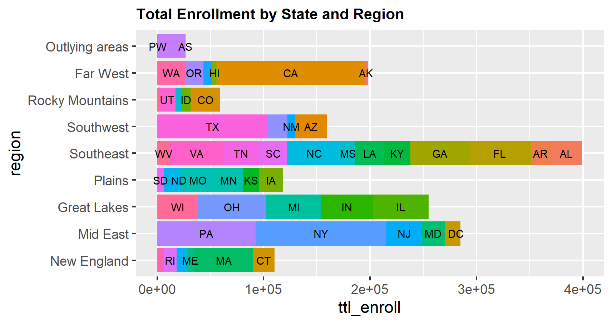

# Lab 1 Part 1

## Total Applications to Colleges Offering at Least a 4-Year Degree
 
> This bar plot (made through ggplot) was the first plot made in this lab. It was difficult to make, as I kept accidentally deleting my data and I didn't set the working directory manually at the beginning of the code. This plot describes the number of applications per state and per region to colleges that offer at least 4-year degrees.

## Total Applications to Colleges Offering at Least Doctoral Degrees

> Similar to the previous plot, this plot describes the number of applications per state and per region to colleges that offer at least Doctorate level degrees. The difference between this plot and the 4-year college plot is that this plot has overall a lot fewer applications, and have some U.S. service schools.

## Total Enrollment to Colleges Offering at Least a 4-Year Degree

> This plot describes the enrollment levels by region and state for colleges offering at least a 4-year degree. This plot was much easier to make, since it was the same steps as the previous plots.

## Total Enrollment to Colleges Offering at Least a Doctoral Degree

> Just like the plot before, this plot describes the enrollment levels by region and state for colleges offering at least a Doctoral level degree.

## Total Enrollment to Colleges By Region and State

> This plot was different from all of the other plots, since it didn't use doc_colls or 4_year_colls data sets. Instead it used the inst_data values to give an overall plot of enrollment levels by region and state.
