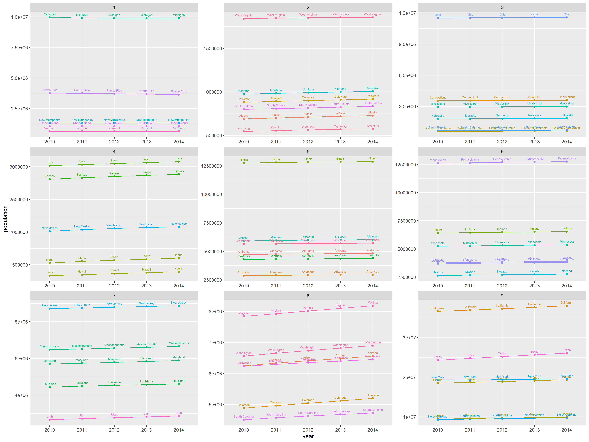
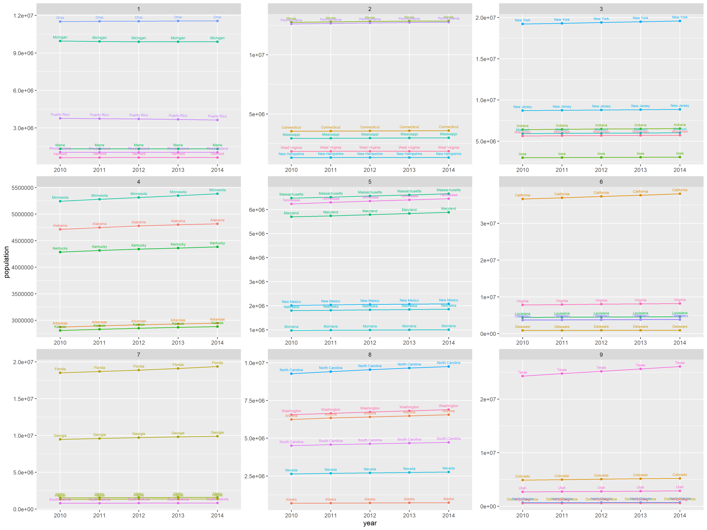

# Lab 2 Part 1
### Absolute Population Increase

> In this plot, the absolute population increase by year from 2010 to 2014 in the United States including Puerto Rico. The data has been separated into 9 quantiles that show the information in a much more digestable way.

### Average Population Increase

> In this plot, the average population increase by year from 2010 to 2014 in the United States including Puerto Rico. The data has been separated into 9 quantiles that show the information in a much more digestable way.
