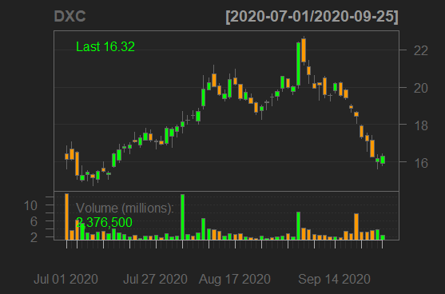
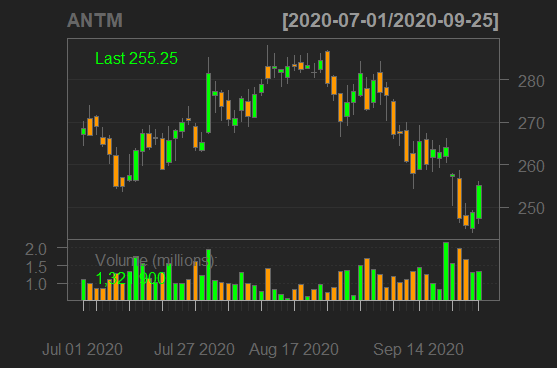
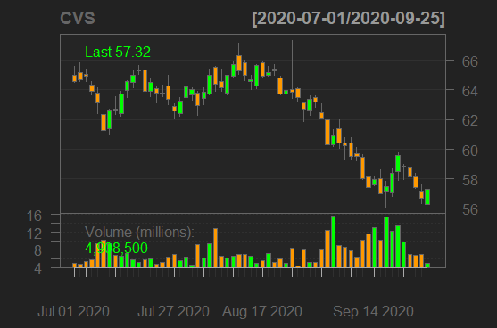
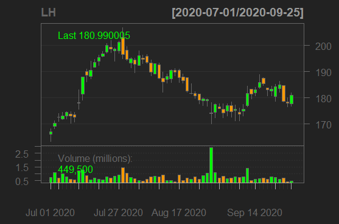
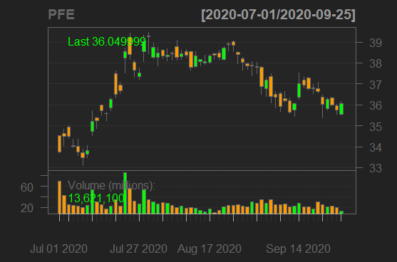
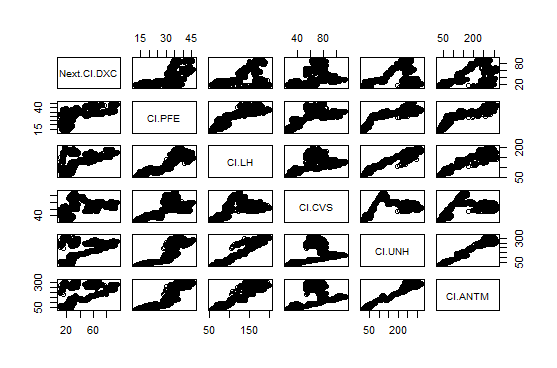
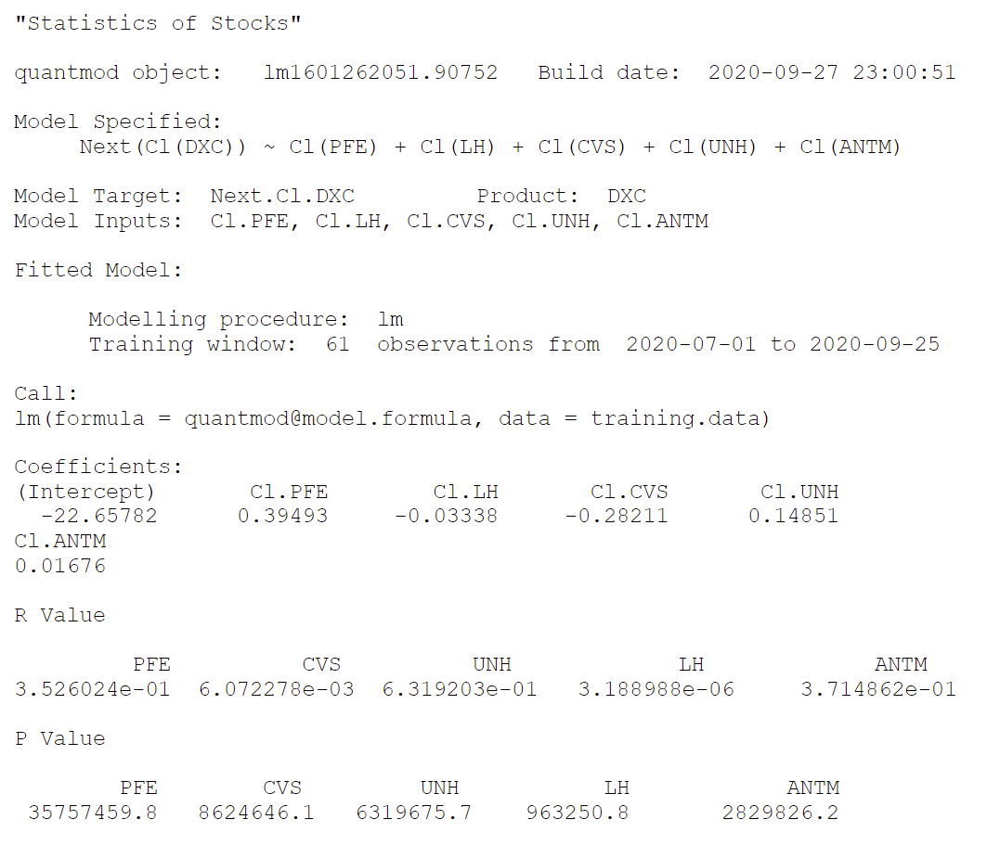

# Lab 2, Part 2: Stocks

## Stocks Raw Data
### Response Variable
##### DXC Technologies 

> DXC technologies (DXC) is the response variable in this project, which means that the other variables are being used to predict the outcome of this stock the day after the other stocks close. This company is a IT company that has a sector that processes medicaid claims for various states. This is also the company my father works, and the predictor variable stocks were chosen since they are all various healthcare companies and their stocks.

### Predictor Variables
> The following stocks are the predictor variables for this data set. These stocks are used to help predict the outcomes of the response stock by comparing closing stocks of one day of all of the following with the next day closing price of the response stock.

##### Anthem Blue Cross Blue Shield Insurance 

##### CVS Health

##### Lab Corp 

##### Pfizer Pharmaceuticals 
 

##### United Healthcare Group

## Matrix Plot
 
The above plot is an analysis of the relationship between DXC and the predictor stocks. There doesn't appear to be a strong correlation between the predictor stocks and the response stock, however, there does appear to be one between United and Anthem Healthcare.

## Statistical Analysis

> According to the statistical analysis above, there is a very weak correlation between all of the predictor stocks and the response stock. There is a weak negative correlation CVS and LabCorp and DXC. There is a weak positive correlation between the rest of the predictors and DXC. The pVolume values indicate the volume of the stock that was traded during the three months that the data was pooled from. Pfizer has the largest of these values while LabCorp has the lowest. The rValue numbers indicate the predictive properties of the predictive stocks on the response. Of the predictors, United Health and CVS had the highest values, which means they were the best predictors, while LabCorp had the lowest value.
