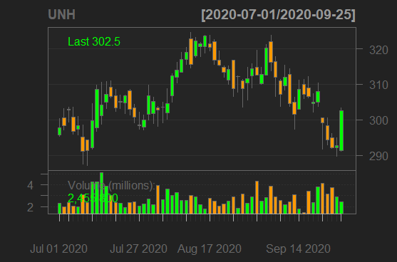

# Lab 2, Part 2: Stocks

## Stocks Raw Data
### Response Variable
##### DXC Technologies 

> DXC technologies (DXC) is the response variable in this project, which means that the other variables are being used to predict the outcome of this stock the day after the other stocks close. This company is a IT company that has a sector that processes medicaid claims for various states. This is also the company my father works, and the predictor variable stocks were chosen since they are all various healthcare companies and their stocks.

### Predictor Variables
> The following stocks are the predictor variables for this data set. These stocks are used to help predict the outcomes of the response stock by comparing closing stocks of one day of all of the following with the next day closing price of the response stock.

##### Anthem Blue Cross Blue Shield Insurance 

##### CVS Health

##### Lab Corp 

##### Pfizer Pharmaceuticals 
 

##### United Healthcare Group

## Matrix Plot
 
> 

## Statistical Analysis

> 
