# Lab 2 Part 3
## Deliverables
### Return Plot
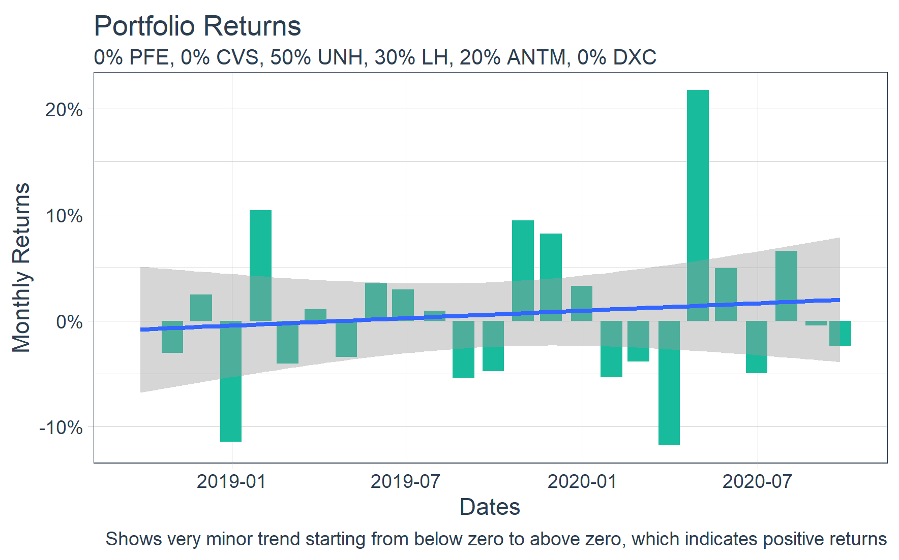
> The stocks that I selected for this project have not been doing great over the past couple months, so the returns on the investment are not incredibly high. As shown in the plot above, there are very low returns currently on the stocks invested.
### Growth Plot
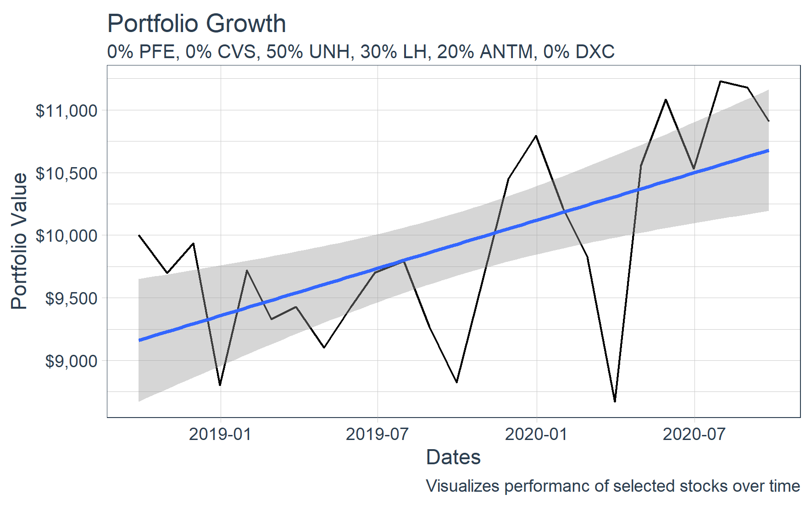
> In the plot above, it shows that if the $10,000 were to be invested into the stocks selected in the quantities specified in the subtitle, there would be about $750 profit. The stocks selected are doing well currently, but they have all gone down since the beginning of the investment period.

## Stretch Goals
### Costco
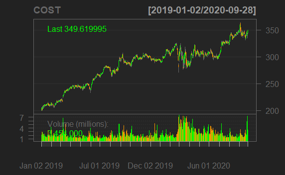
### Target
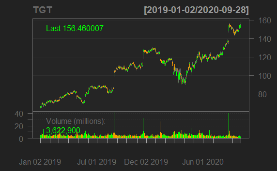
### Walmart
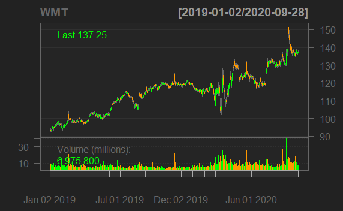
### Five Below
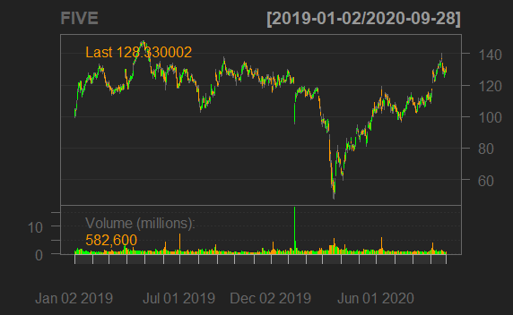
### Dollar Tree
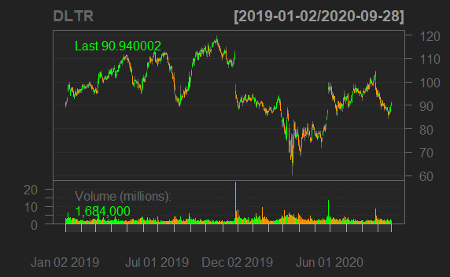
### Ollies
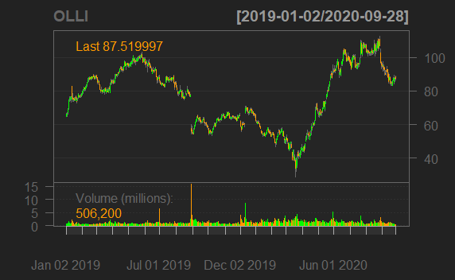
### Matrix
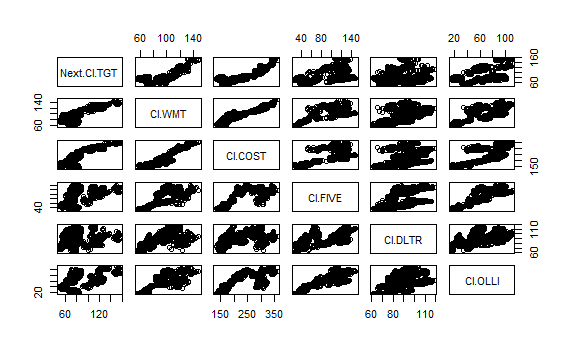
### Return Plot
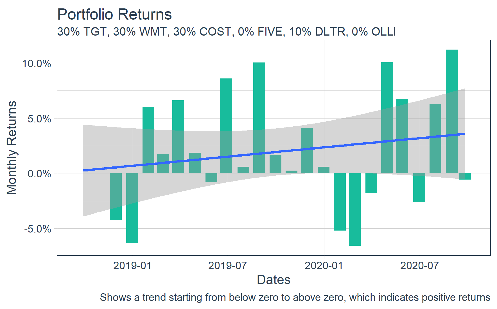
### Growth Plot
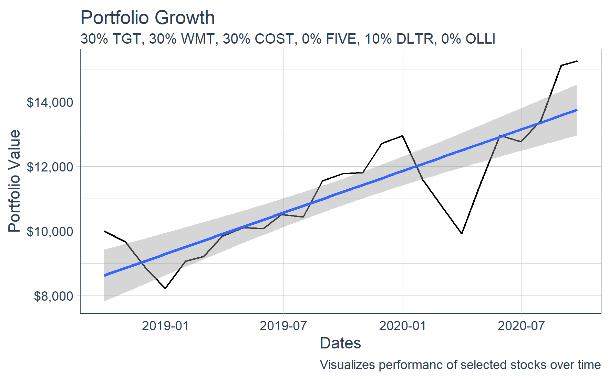
> In this plot with the stretch goal stocks, there was about a $5,000 profit by using the weigths specified in the subtitle. This is a significantly higher profit than the stocks I used for the main part of this lab, since these are all retail locations instead of healthcare companies which haven't been doing well in the past few years. 
