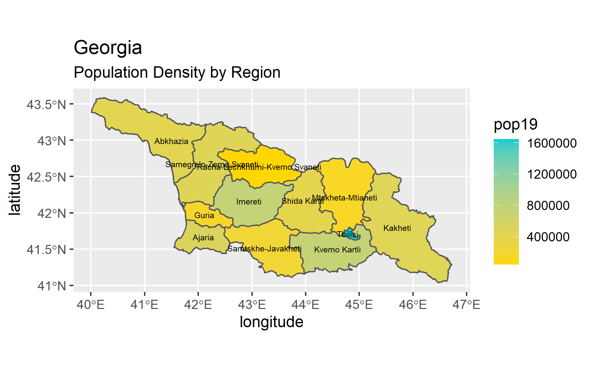
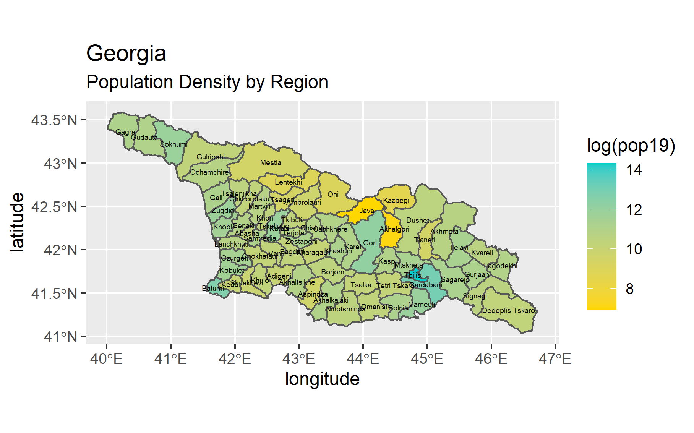

# Lab 3, Part 1

### Map of Georgia

## Stretch Goal 1
### Data from GeoBoundaries

## Stretch Goal 2
### Map of Tbilisi

### Map of Adjara

### Map of Abkhazia

## Stretch Goal 3
### Map of Georgia with Details

## Stretch Goal 4
### Map of Georgia with ADM1 + Population

### Map of Georgia with ADM2 + Population

