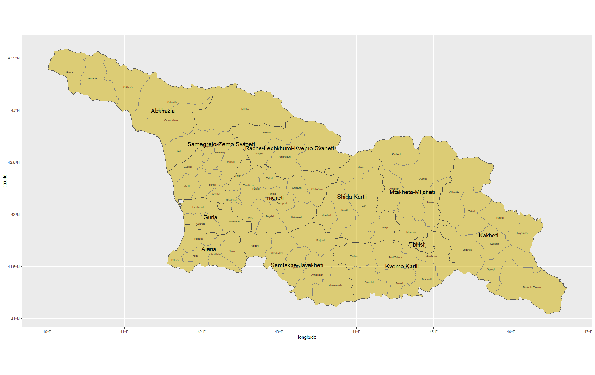
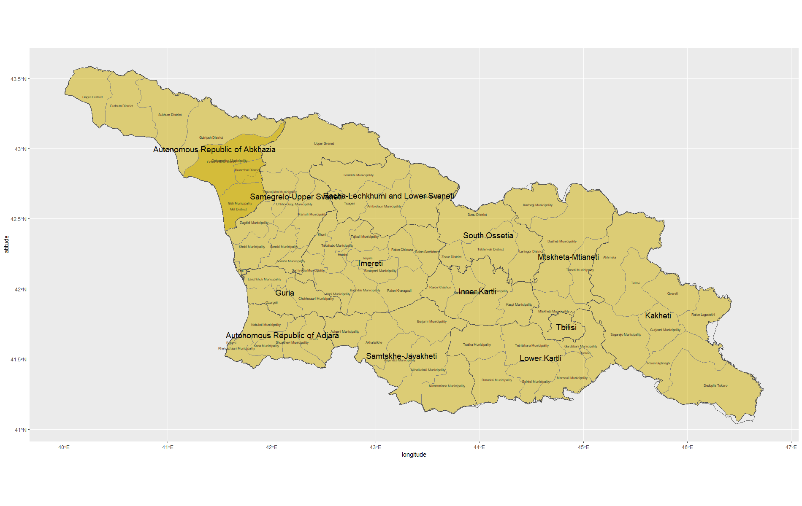
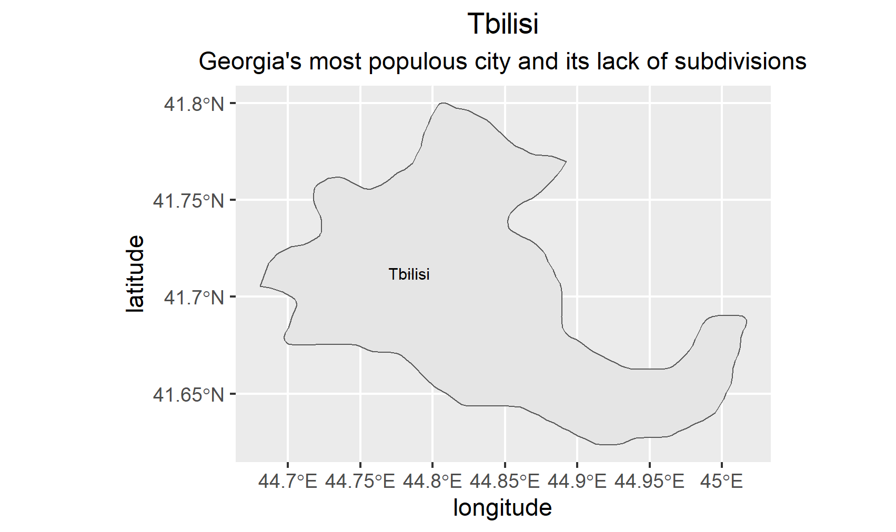
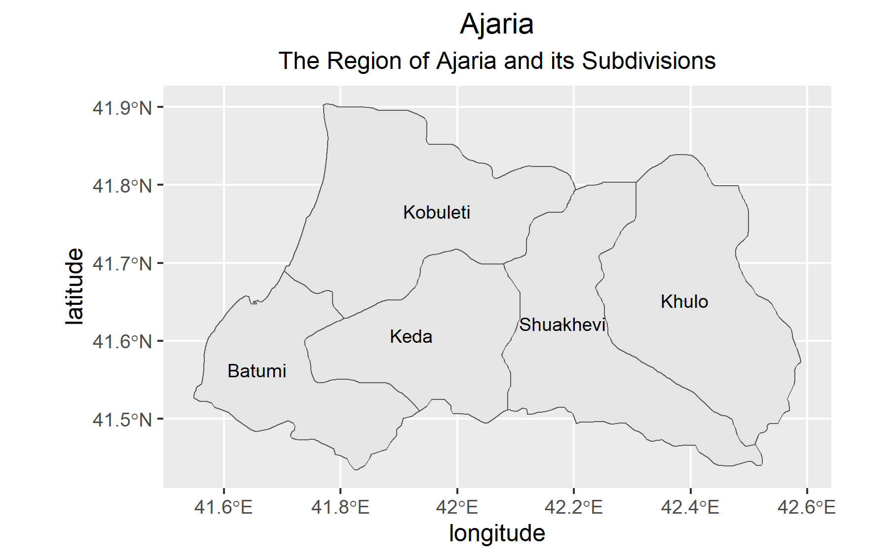
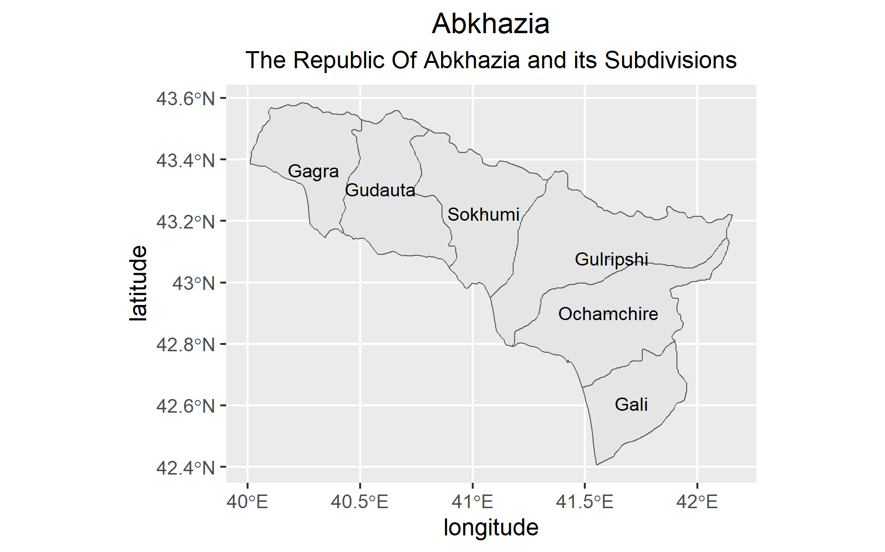
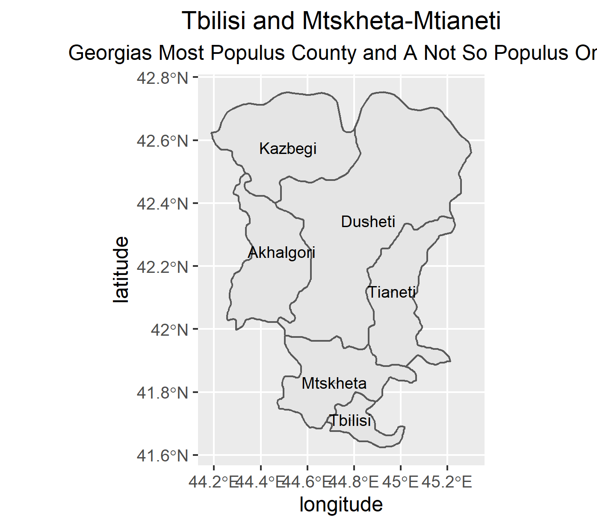
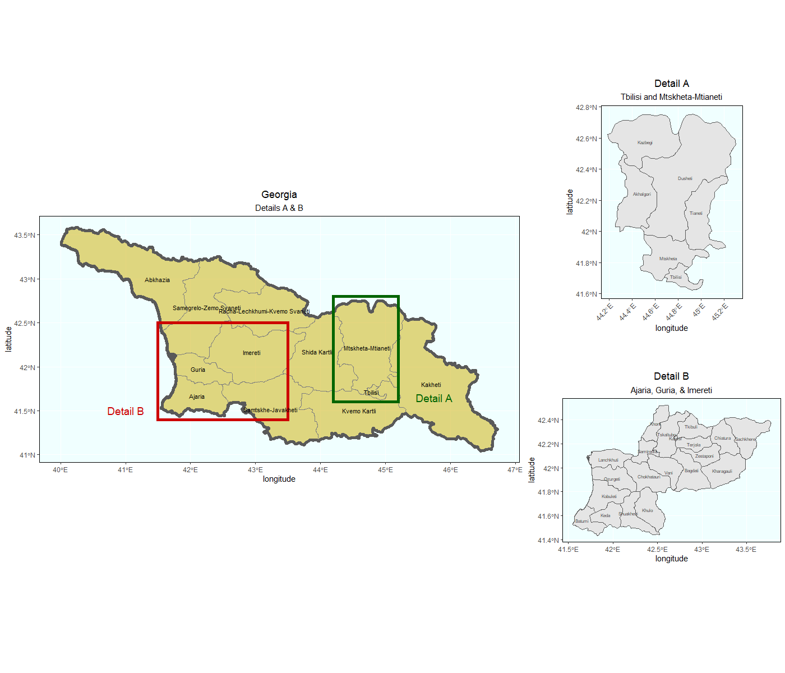

# Lab 3
## Part 1
### Map of Georgia

> This map shows the Country of Georgia (located between Turkey and Russia, and next to the Black Sea) divided into 12 regions, and 69 districts. 

## Part 2
### Data from GeoBoundaries

### Map of Tbilisi

### Map of Adjara

### Map of Abkhazia

### Map of Tbilisi and Mtskheta-Mtianeti

### Map of Georgia with Details

