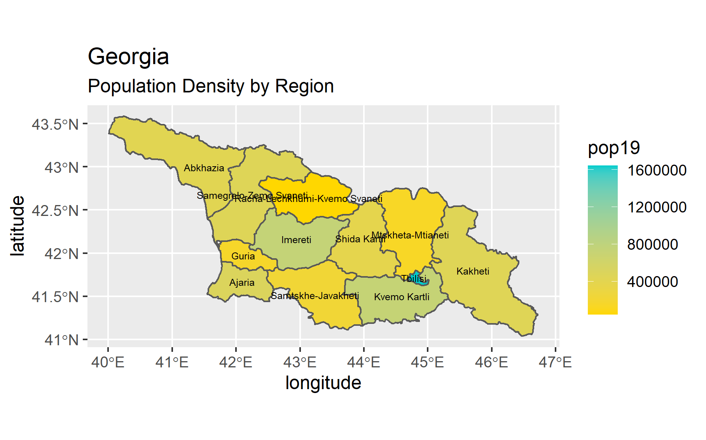
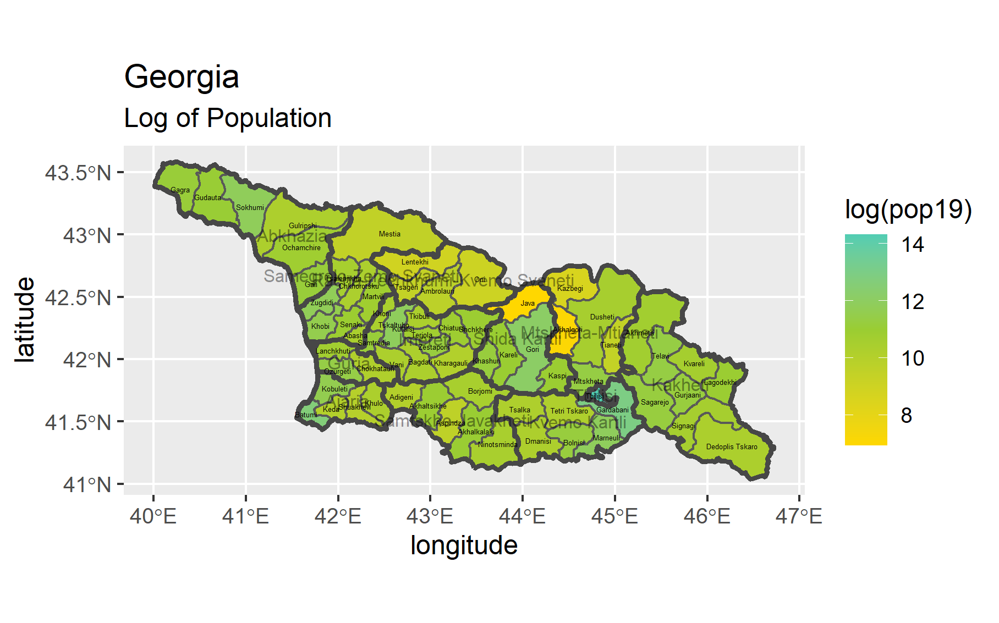

# Lab 4, Part 1

### Map of Georgia with ADM1 & Population

> This image shows a basic plot of Georgia with the ADM1 subdivisions outlined and filled with the color gradient of the population. 

[Larger Image of ADM1 Plot](ggeo_pop19.png)

### Map of Georgia with ADM2 & Log Population

> This image shows a plot of Georgia with the ADM2 subdivisions outlined and filled with the color gradient of the log of the population. 

[Larger Image of ADM2 Plot](2geo_pop19.png)

### Map of Georgia with ADM1, ADM2, & Log Population

> This image shows a plot of Georgia with the ADM1 and ADM2 subdivisions outlined and filled with the color gradient of the log of the population.  

[Larger Image of ADM1 and ADM2 Plot](loggeo.png)

### Gif of Georgia Population Density

>  This Gif file shows a 3D representation of the population of Georgia. It shows the population represented by both the color of the subdivision and the elevation of the subdivision above the image.
