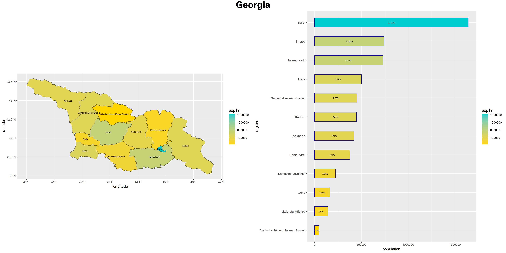
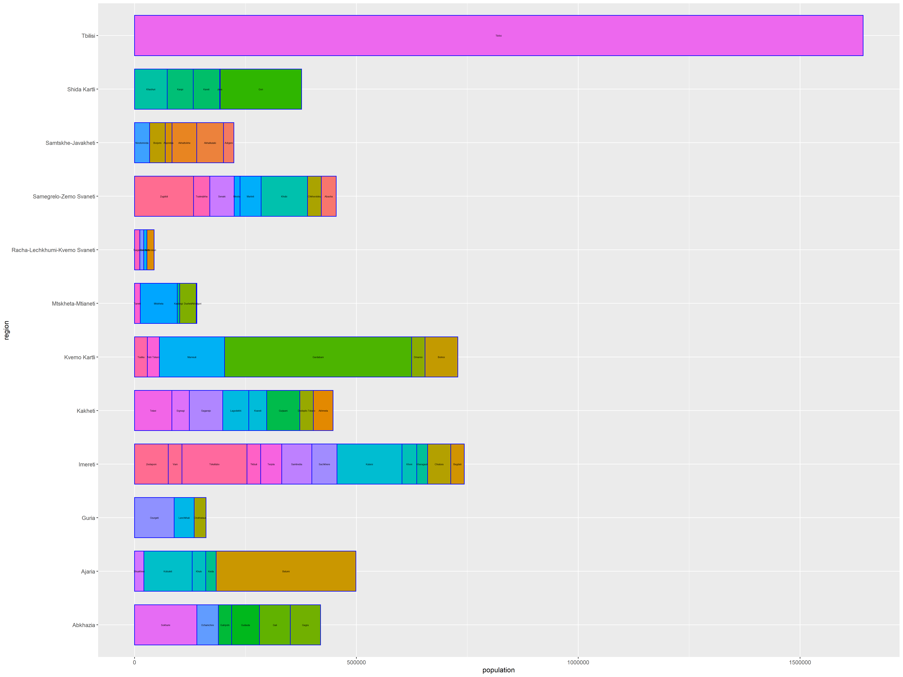

# Lab 4 Part 2

### Plot of Both Georgia and Barplot

> 

[Larger Image of Plot](liberia.png)

### Stretch Goal 

> In this plot, there is a discription of the population of Georgia broken up into districts and subdivisions in a barplot. There are the larger districts on the y axis and the individual subdivisions within each bar.

[Larger Image of Stretch Goal](lbr_adm2_bp.png)
