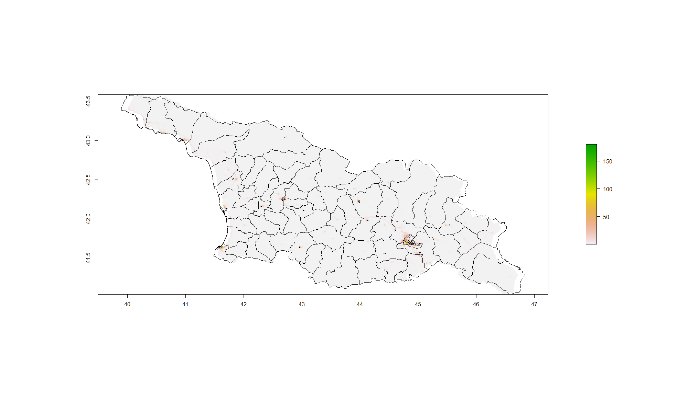
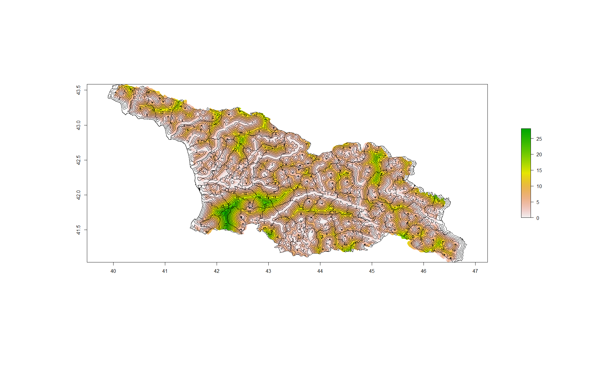
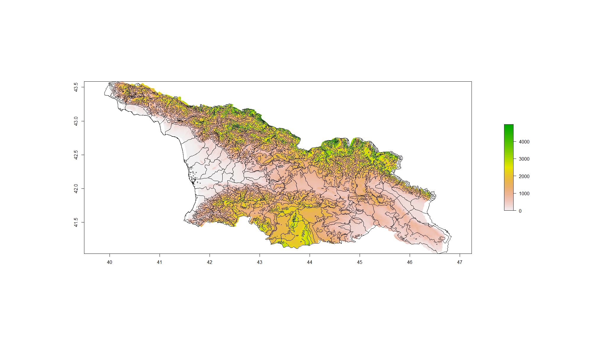

# Lab 5 
## Population

> This plot depicts the log values of the population in Georgia. The histogram represents the data in bins, while the line plot demonstrates the density of the population. Since the log is taken, there is a clear bell curve in population amounts. If I had to guess, I would say that the upper end belongs to Tiblisi while the lower end of the data set belongs to Racha-Lechkhumi-Kvemo Svanti, which is located in the northern middle part of the country.

## Night Time Lights

[larger image of geospatial plot](ntl.png)
> The two plots above describe the 'night time lights' of Georgia. There is a major disparity between Tiblisi and the rest of the country. This is because Tiblisi is the capitol of Georgia, and is the biggest city in the country. Tiblisi has the highest population and is different from the rural and small towns that occupy most of the rest of the country. As you can see in the second of the two plots, outside of the capitol, there's very minimal night time lights, but there are still scattered locations around the country that do in fact have at least a little bit of lights. The histogram shows that the vast majority of the country has no night time lights, and there are two locations that have a lot of night time lights. 

## Water

[larger image of geospatial plot](waterplot.png)
> The two plots above describe the water density within the country of Georgia. The histogram shows that a vast majority of the country has a moderate amount of water, at around "1e+6" units of water per grid unit. Georgia is very rich with natural resources such as water, and it's evident in the plots above. There are quite a few rivers and other water systems in this country. 

## Topography

[larger image of geospatial plot](topo.png)
> The two plots above describe the topography and density of topography in Georgia. The northern side of the country has the Greater Caucus Mountain Range and the southern side has the Petit Caucus mountains. The histogram shows that most of the country has very little topographical significance. However, there is quite a few sections of the country that have a lot of topography, which is shown on the upper end of the histogram.
