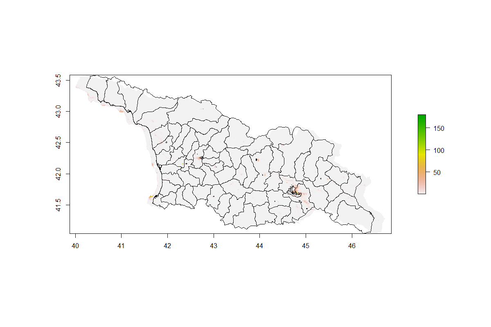

# Lab 5 
### Population

> This plot depicts the log values of the population in Georgia. The histogram represents the data in bins, while the line plot demonstrates the density of the population. Since the log is taken, there is a clear bell curve in population amounts. If I had to guess, I would say that the upper end belongs to Tiblisi while the lower end of the data set belongs to 

### Night Time Lights

### Water

### Topography

