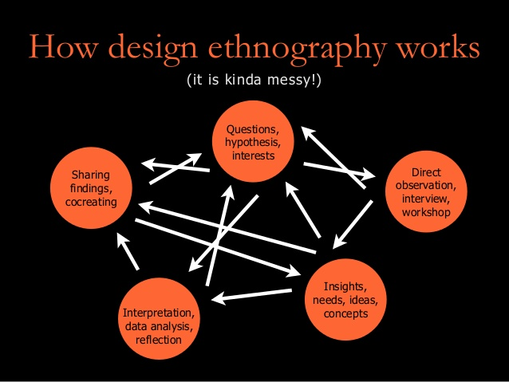

# Data Science Reflection 2
## Computational Ethnography and Curation of Data for Chronic Pain and Invisible Disability

 

Chronic pain is an umbrella term used to describe a multitude of complicated “biopsychosocial, environmental, and subjective” medical ailments that affect over 100 million Americans today (Moore, 2020). Due to so many individuals suffering from chronic pain, the approximated cost is nearly $635 billion annually, and yet there is still no “objective measurement” for the detection of chronic clinical pain intensity (Moore, 2020). In recent years, AI methods have been developed to aide in tracking pain for chronic pain patients. These methods include virtual pain diaries, and predictive software for pain spikes. Despite the common nature of pain as a symptom and disease, it’s incredibly difficult to accurately discuss and quantify. In the US, pain is “an important source of morbidity, personal and social suffering” that leads to difficulty in treatment due to a fluid and deeply personal definition of pain (Moore, 2020). Ethical conundrums and fairness “in the context of pain and invisible disability” lead to RWD methods and computatio
nal ethnography employment for collection of data and application of knowledge (Moore, 2020). 

A major issue that comes to light when dealing with chronic pain and the collection of data is the large number of pain scales that are used worldwide. Some of the most popular include NRS (numerical rating scale), Wong-Baker Faces Scale, and VRS (verbal rating scale) (Jacques, 2020). According to NCBI, NRS and VRS are the most effective and reliable pain scales in use today. Because these scales are simple to understand and use, pain diaries are used for patients with chronic pain so that their health care team can have the ability to gather a better insight into how daily activities affect pain (Danise, 2013). With virtual pain diaries gaining more popularity, health care professionals can send out more in-depth questionnaires to their patients when there are peaks in pain. This allows for patients and their health care team have a better understanding on how certain activities affect the patient. 

Artificial Intelligence has increased in importance for the diagnosis and treatment of pain in recent years. Mainly, AI has been employed in the processing of language translation, natural speech, and image recognition. In the realm of chronic pain, this technology can be used to increase the “probability of an accurate diagnosis, treatment, and prediction of outcomes” (Moore, 2020). As mentioned in the previous paragraph, differing pain scales that are a combination of verbal and quantitative led to difficulties in AI-ML. Due to these difficulties, scientists generally convert qualitative and other complicated scales to a simple NRS for the sake of improving the accuracy of machine learning. 

According to Moore, there has been research in the past few years that artificial intelligence machine learning in the ways of neuroimaging and “predictive pain phenotype prediction” for the detection of pain and the management of chronic pain. A different study used AI-ML in extreme pain-phenotypes and the effects of chronic pain on sleep problems (Miettinen, 2020). This is very interesting that Machine Learning can take RWD and create plausible diagnosis criteria for chronic pain conditions. It’s fascinating how much farther this could be taken in the regards of diagnosis and treatment in the future, and how chronic pain may one day get a concrete treatment path for individual patients. 

Another data science method that is being employed is called computational ethnography. This is a qualitative method that allows researchers to learn about people through “contextual data immersion,” which includes observations and interviews with individuals (Moore, 2020). Ethnography itself is a popular method used in healthcare to understand more about patients and their needs. The computational aspect quantifies this data and makes it more cohesive for a patient's healthcare team to understand and work with. Combining computational ethnography with AI-ML leads to a deeper understanding of large system norms such as cultural and societal trends. Moore describes some of the specific ways that computational ethnography can enhance AI in the paper. These include understanding outlier detection and transparency as well as societal justice for underrepresented groups in healthcare (Moore, 2020). With the help of computational ethnography and AI-ML, it could be that the future of healthcare will include a more holistic and representative data set. This can make early detection, diagnosis, and treatment of all conditions, not just chronic pain, commonplace. 

## Works Cited

Armstel, F. V. (2016, September 1). Design ethnography [Digital image]. Retrieved September 30, 2020, from https://www.slideshare.net/usabilidoido/design-ethnography-with-activity-theory 

Dansie, E., & Turk, D. (2013, July). Assessment of patients with chronic pain. Retrieved September 30, 2020, from https://www.ncbi.nlm.nih.gov/pmc/articles/PMC3841375/ 

Deardorff, W., PhD. (2017, February 2). Chronic Pain Model [Digital image]. Retrieved September 30, 2020, from https://www.spine-health.com/conditions/chronic-pain/understanding-chronic-pain 

Jacques, E. (2020, January 5). 10 Common Types of Pain Scales. Retrieved September 30, 2020, from https://www.verywellhealth.com/pain-scales-assessment-tools-4020329 

Lötsch J, Alfredsson L, Lampa J. Machine-learning based knowledge discovery in rheumatoid arthritis related registry data to identify predictors of persistent pain. Pain. 2019 Aug 30. doi: 10.1097/j.pain.0000000000001693. 

Miettinen, T., Mäntyselkä, P., Hagelberg, N., Mustola, S., Kalso, E., & Lötsch, J. (2020). Machine learning suggests sleep as a core factor in chronic pain. *Pain*, 10.1097/j.pain.0000000000002002. Advance online publication. https://doi.org/10.1097/j.pain.0000000000002002 

Moore, R. J., Smith, R., & Liu, Q. (2020). Using computational ethnography to enhance the curation of real-world data (RWD) for chronic pain and invisible disability use cases. *ACM SIGACCESS Accessibility and Computing*, (127), 1-7. 
