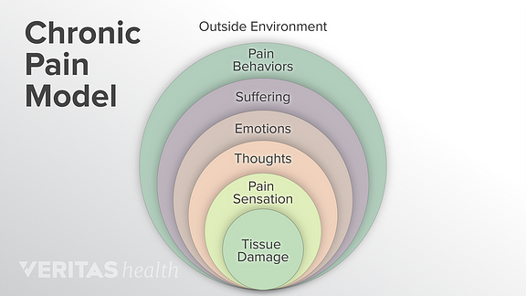

# Data Science Reflection 2
## Computational Ethnography and Curation of Data for Chronic Pain and Invisible Disability
Chronic pain is an umbrella term used to describe a multitude of complicated “biopsychosocial, environmental, and subjective” medical ailments that affect over 100 million Americans today (Moore, 2020). Due to so many individuals suffering from chronic pain, the approximated cost is nearly $635 billion annually, and yet there is still no “objective measurement” for the detection of chronic clinical pain intensity (Moore, 2020). In recent years, AI methods have been developed to aide in tracking pain for chronic pain patients. These methods include virtual pain diaries, and predictive software for pain spikes. Despite the common nature of pain as a symptom and disease, it’s incredibly difficult to accurately discuss and quantify. In the US, pain is “an important source of morbidity, personal and social suffering” that leads to difficulty in treatment due to a fluid and deeply personal definition of pain (Moore, 2020). Ethical conundrums and fairness “in the context of pain and invisible disability” lead to RWD methods and computational ethnography employment for collection of data and application of knowledge (Moore, 2020). 

A major issue that comes to light when dealing with chronic pain and the collection of data is the large number of pain scales that are used worldwide. Some of the most popular include NRS (numerical rating scale), Wong-Baker Faces Scale, and VRS (verbal rating scale) (Jacques, 2020). According to NCBI, NRS and VRS are the most effective and reliable pain scales in use today. Because these scales are simple to understand and use, pain diaries are used for patients with chronic pain so that their health care team can have the ability to gather a better insight into how daily activities affect pain (Danise, 2013). With virtual pain diaries gaining more popularity, health care professionals can send out more in-depth questionnaires to their patients when there are peaks in pain. This allows for patients and their health care team have a better understanding on how certain activities affect the patient. 

<img align = center src = "dethno.jpg" height = "200" width = "300")
