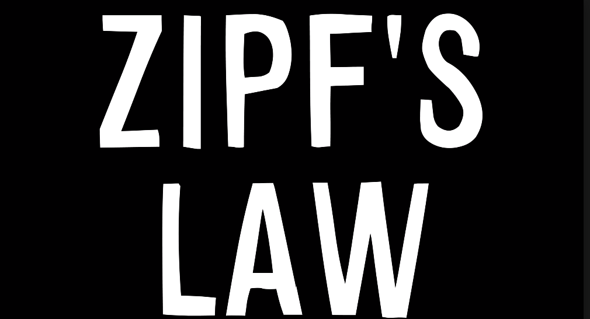

# Power Law in Geoscience

 
The first of the three major mathematic laws (which are all incredibly similar) that relate to the geoscience aspect of this reflection is Zipf’s Law. In 1935, George Kingsley Zipf developed a mathematical law describing the occurrences of words in all written language (Zipf’s Law, 2020). The equation that can be used to roughly describe this law is **a = 1 + 1/b**(Adamic). In this equation, b is equal to the ranking of the commonality object and a is equal to frequency of the selected object. In the image to the left, there is a graphical representation of this mathematical law. In this graph, the log of the frequency and the log of the rank of the objects is graphed, and it creates a straight line. To explain this equation, its best to look at what Zipf originally created the law for, linguistics. The three most common words in the English language are “the”, “of”,  and “and” (Stevens, 2015). If we take the frequency of “the” and compare it to the frequency of the following words, the usage is proportional to their rank. So by this logic, “of” occurs half as often as “the”, and “and” occurs a third as often as “the”. This law continues with every known word in English, as well as many other languages (Stevens, 2015). This law is not only used for word counts, however. It can be manipulated and changed slightly into at least 2 other mathematical principals that can in turn mathematically explain nearly everything on Earth.

 
Power law distribution is very similar to Zipf's law in that it shows a correlation between two qualities of objects that seems to be naturally occurring. Geoffrey West is a physicist who has done a lot of work with power laws (Melinda, 2018). This law shows that the frequency of something occurring and the power of said ‘thing’ is strongly related. It can be applied to nearly everything from urbanization to policymaking to anthropology to nature (Melinda, 2018). Theoretically, nearly everything can be explained by this law, and it strongly related to the next law due to the distribution of many occurrences being rare while a few are incredibly common. This can relate to data science, because it can simplify data quite easily. Power laws can allow for the relationships between phenomena to become more evident, while also allowing for a quicker way to isolate the more relevant data (Making Big Data Small, 2020).

 
Similar to the prior two laws, Pareto’s law describes a wide array of topics with mathematical properties. The simple explanation of this distribution is that the top 20% of causes leads to 80% of the effects (Adamic). This is commonly used in economics, as a way to maximize profits. For example, in 1989, the richest 20% of the worlds population earned 82.7% of the worldwide income (Pareto Principle, 2020). Another economic look can show that 80% of profit comes from 20% of products. It’s also commonly used in computational software. 80% of errors comes from 20% of the code, according to Microsoft (Pareto Principle, 2020). This distribution can be found nearly everywhere, and appears to be a naturally occurring concept that can also explain many natural, geospatial issues (Corral, 2019).

### Here's a great video on the topic of Zipf's Law and Power Law Distribution

## Works Cited
Adamic, L. A. (n.d.). Zipf, Power-laws, and Pareto - a ranking tutorial. Retrieved October 29, 2020, from https://www.hpl.hp.com/research/idl/papers/ranking/ranking.html
Basic Power Law [Digital image]. (2016). Retrieved October 29, 2020, from https://exploitingchange.com/wp-content/uploads/2016/09/power-law-basic.gif
Corral, Á, & González, Á. (2019, May 31). Power Law Size Distributions in Geoscience Revisited. Retrieved October 29, 2020, from https://agupubs.onlinelibrary.wiley.com/doi/full/10.1029/2018EA000479
Making Big Data Small Data - the Role of Power Laws: Data Science: Near Tech Blog: Near - Blog. (2020, May 07). Retrieved October 30, 2020, from https://blog.near.co/technology/making-big-data-small-data-the-role-of-power-laws/ 
Masrai, A. (2006). Zipf's Distribution, log-log graph [Digital image]. Retrieved October 29, 2020, from https://www.researchgate.net/profile/Ahmed_Masrai/publication/292132735/figure/fig1/AS:322609200812032@1453927435272/Zipf-distribution-log-log-graph-for-types-across-the-web-based-corpus-Sharoff-2006.png
Melinda, B. (2018, January 26). Q&A: Geoffrey West on the universal laws of growth. Retrieved October 29, 2020, from https://physicstoday.scitation.org/do/10.1063/pt.6.4.20180126a/full/
Milojcic, M. (2018, December 4). Pareto Principle [Digital image]. Retrieved October 29, 2020, from https://www.teodesk.com/wp-content/uploads/2018/12/2.jpg
Pareto principle. (2020, October 25). Retrieved October 30, 2020, from https://en.wikipedia.org/wiki/Pareto_principle 
Stevens, M. (Director). (2015, September 15). The Zipf Mystery [Video file]. Retrieved October 29, 2020, from https://www.youtube.com/watch?v=fCn8zs912OE
Zipf's law. (2020, October 11). Retrieved October 29, 2020, from https://en.wikipedia.org/wiki/Zipf's_law
